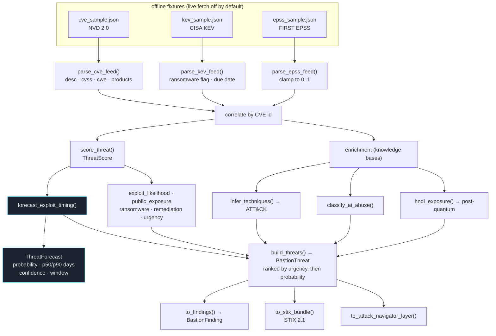

# Threat Forecast

Turns offline CVE / CISA KEV / FIRST EPSS feeds into ranked threats with an
explainable exploit-**timing** forecast, ATT&CK/AI-abuse/PQC enrichment, and
STIX / ATT&CK Navigator export.

**How to read it.** Three feeds are parsed independently, then joined on the CVE
id so a single threat carries CVSS (from NVD), known-exploited + ransomware
signals (from KEV), and an exploitation probability (from EPSS). `score_threat`
blends those into an explainable 0–1 urgency; `forecast_exploit_timing` then
converts the same signals into a *time* estimate — KEV means "already exploited,
horizon 0", otherwise a pressure blend compresses the p50/p90 day estimate and
raises the probability. Enrichment runs off the description text: technique
inference, AI-abuse classification, and harvest-now-decrypt-later exposure.

**Why it matters.** The forecast answers "how soon" not just "how bad", and the
inferred ATT&CK techniques are the join key the correlation spine uses to find
threats you can't yet detect.

**Key code.**
[`adapters/detector_engine_adapter.py`](../../src/greynoc_bastion/adapters/detector_engine_adapter.py)
— `parse_cve_feed` / `parse_kev_feed` / `parse_epss_feed`, `score_threat`,
`forecast_exploit_timing`, `build_threats`.
[`knowledge/attack.py`](../../src/greynoc_bastion/knowledge/attack.py) `infer_techniques`,
[`knowledge/ai_abuse.py`](../../src/greynoc_bastion/knowledge/ai_abuse.py) `classify_ai_abuse`,
[`knowledge/postquantum.py`](../../src/greynoc_bastion/knowledge/postquantum.py) `hndl_exposure`.
Exports: [`services/threat_intel_export.py`](../../src/greynoc_bastion/services/threat_intel_export.py).
Schema: [`schemas/threat.py`](../../src/greynoc_bastion/schemas/threat.py) `BastionThreat`, `ThreatForecast`.
