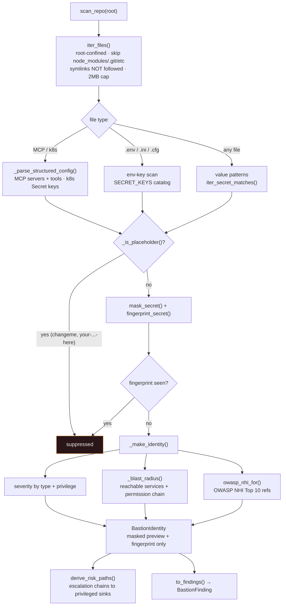

# Identity Blast Radius

Scans a repo/project tree for non-human identities. **Secrets are masked at the
point of discovery and never validated or replayed** — only a masked preview and
a one-way fingerprint ever leave the scanner.

**How to read it.** Traversal is deliberately conservative (root-confined,
skip-listed, no symlink following, size-capped). Each file is examined three
ways: structured configs are parsed for real content (each MCP server and each
Kubernetes `Secret` key becomes an identity), `.env`-style files are matched
against the curated `SECRET_KEYS` catalog, and every file is scanned for
high-confidence value patterns. Obvious placeholders are dropped, real values are
immediately reduced to a masked preview plus a fingerprint (which also de-dupes),
and the identity is scored with a blast radius and OWASP references.
`derive_risk_paths` then looks across *all* discovered identities to surface the
escalation chains that reach privileged sinks (cloud control plane, prod deploy).

**Safety invariant.** `is_active_unknown` is always true — Bastion never tests
whether a credential is live. `BastionIdentity.__post_init__` re-masks any preview
that isn't actually masked (star-ratio check) as a backstop.

**Key code.**
[`adapters/nhi_adapter.py`](../../src/greynoc_bastion/adapters/nhi_adapter.py)
— `iter_files`, `_parse_structured_config`, `scan_repo`, `_make_identity`,
`_blast_radius`, `derive_risk_paths`, `SECRET_KEYS`.
[`safety/masking.py`](../../src/greynoc_bastion/safety/masking.py) `mask_secret`,
`fingerprint_secret`, `iter_secret_matches`.
[`knowledge/owasp.py`](../../src/greynoc_bastion/knowledge/owasp.py) `owasp_nhi_for`.
