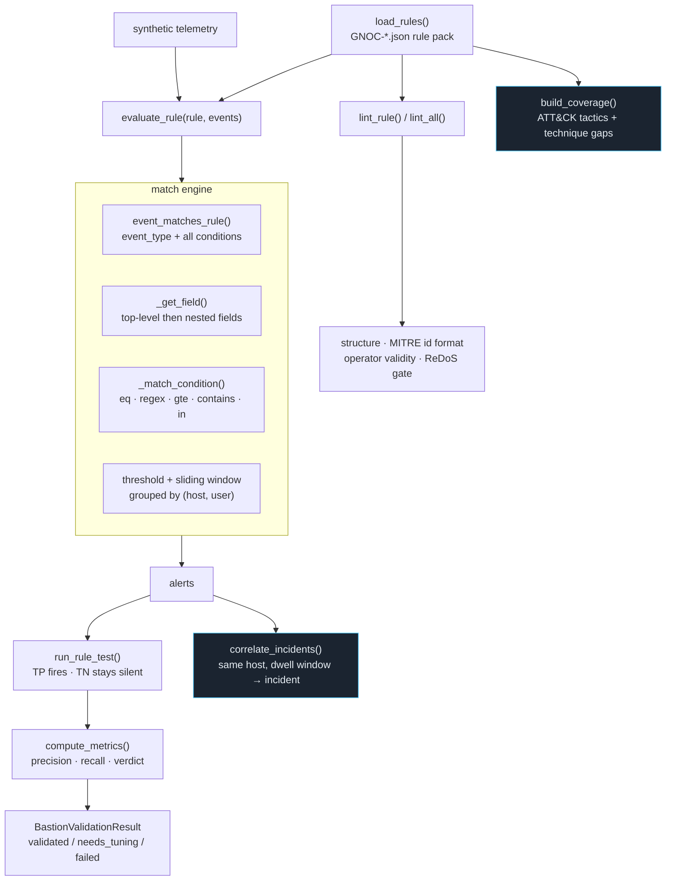

# Detection Validation

Replays synthetic telemetry against detection rules to prove whether a detection
is ready, needs tuning, or should be deprecated — plus a rule linter, an ATT&CK
coverage map, and multi-stage incident correlation. **Synthetic telemetry only;
no live network.**

**How to read it.** A rule is first linted statically (is it well-formed, are its
MITRE ids valid, are its operators known, is any regex ReDoS-safe). The match
engine resolves each field from the event's top level *or* its nested `fields`
map, applies the matcher (exact equality by default; `contains`/`regex`/numeric
ops explicit), and aggregates matches per `(host, user)` within the rule's
threshold and sliding time window. Validation runs the rule against its
true-positive set (must fire) and true-negative set (must stay silent), then
`compute_metrics` assigns a verdict. Two analysis views sit alongside: a coverage
map (which ATT&CK tactics/techniques the pack covers, and the gaps) and incident
correlation (chaining multi-stage activity on one host into a single incident
with dwell time).

**A fixed bug worth noting.** `GNOC-DISC-001` shipped with `\b` in a JSON string —
which JSON parses as a backspace, silently breaking the `net user` branch. It's
corrected in the bundled fixture and covered by a regression test.

**Key code.**
[`adapters/dmz_adapter.py`](../../src/greynoc_bastion/adapters/dmz_adapter.py)
— `load_rules`, `lint_rule`/`lint_all`, `event_matches_rule`, `_get_field`,
`_match_condition`, `evaluate_rule`, `run_rule_test`, `validate_scenario`,
`build_coverage`, `correlate_incidents`.
[`schemas/detection.py`](../../src/greynoc_bastion/schemas/detection.py)
`BastionValidationResult.compute_metrics`.
[`utils/redos.py`](../../src/greynoc_bastion/utils/redos.py) `is_safe_regex`.
