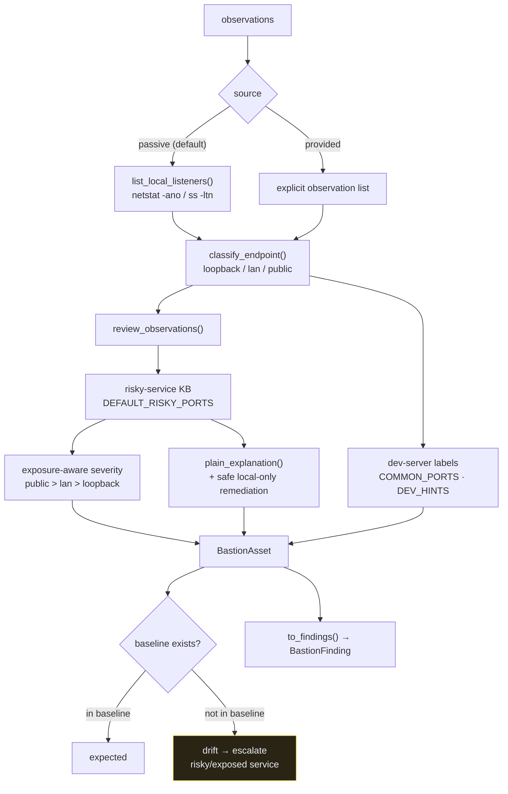

# Assets & Exposure

Reviews local listening services in plain English. **Passive by default** — it
reads the machine's own socket table (no packets are sent) and never changes any
system setting.

**How to read it.** By default the service reads the OS socket table (local
introspection, not a scan) and classifies each bind address as loopback, LAN, or
public. HomeGuard's risky-port knowledge base supplies a plain-English "what this
is" and a severity that escalates with exposure — the same RDP port is low on
loopback but high on the LAN. Port-Manager knowledge labels dev servers
(Vite/Next/Flask/…). If a known-good baseline has been recorded, any service not
in it is flagged as **drift** and, if risky or externally reachable, escalated.

**Safety.** Active connect-checks stay gated behind config (`BASTION_ACTIVE_CHECKS`),
are private/loopback-only, bounded, and logged. Bastion never probes public
targets and never mutates firewall rules, processes, or files.

**Key code.**
[`services/asset_exposure.py`](../../src/greynoc_bastion/services/asset_exposure.py)
— `scan_local`, `service_signature`, `set_baseline`, drift detection.
[`adapters/homeguard_adapter.py`](../../src/greynoc_bastion/adapters/homeguard_adapter.py)
`DEFAULT_RISKY_PORTS`, `classify_service`, `_plain_explanation`.
[`adapters/port_manager_adapter.py`](../../src/greynoc_bastion/adapters/port_manager_adapter.py)
`list_local_listeners`, `classify_endpoint`, `label_service`, `COMMON_PORTS`, `DEV_HINTS`.
