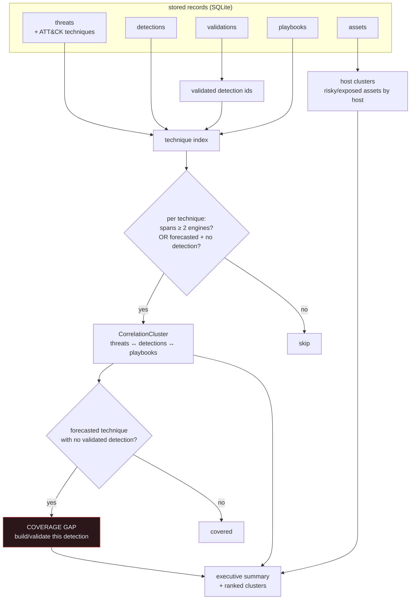

# Correlation Spine

The cross-engine layer that makes Bastion one console instead of seven silos. It
re-reads the stored records and joins them by shared entities, then surfaces the
highest-value operator insight: **forecasted techniques with no validated
detection coverage.**

**How to read it.** Every engine's typed record already carries join material:
threats and detections and playbooks all carry ATT&CK technique ids; assets carry
a host. The spine builds a technique index across threats, detections, and
playbooks, and a host index across assets. A cluster is emitted when a technique
links two or more engines *or* when it's the special coverage-gap case: a
technique that a threat forecast points at but that **no validated detection**
covers. That gap — plus the playbook that already exists for it — is the single
most actionable output of the whole product.

**Example (from the bundled fixtures).** `CVE-2026-12345` (command injection) maps
to `T1059`. No rule in the pack covers `T1059`, so the spine reports it as a
coverage gap and names the applicable playbook — telling the operator exactly what
detection to build next.

**Key code.**
[`services/correlation.py`](../../src/greynoc_bastion/services/correlation.py)
— `CorrelationService.build`, `CorrelationCluster`, `_technique_narrative`,
`_summary`. Join vocabulary:
[`knowledge/attack.py`](../../src/greynoc_bastion/knowledge/attack.py).
