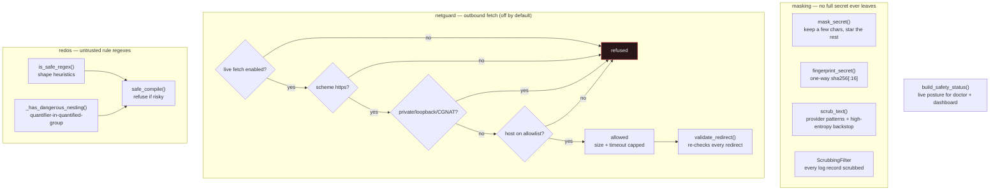

# Safety Layer

The one place every hard safety rule lives, so nothing is reimplemented ad hoc.
Everything that stores, logs, reports, or fetches routes through here.

**How to read it.** Masking reduces any discovered secret to a preview plus a
non-reversible fingerprint; `scrub_text` is the final backstop applied to every
report format and log line (it also catches long high-entropy tokens with a
length-bounded pattern so the scrub itself can't ReDoS). The network guard is a
fail-closed decision chain — live fetch must be explicitly enabled, HTTPS-only,
allowlisted, size/timeout-capped, and it refuses private / loopback / CGNAT /
test-net destinations (SSRF), re-validating every redirect. The ReDoS guard
screens any externally-sourced rule regex — including the general
"unbounded-quantifier-nested-in-a-quantified-group" family — before it is ever
compiled or run. `build_safety_status` renders the live posture for `doctor` and
the Safety Status page.

**Where it's enforced (and tested).** See the guarantees table in
[`../SAFETY_MODEL.md`](../SAFETY_MODEL.md) — each row maps to code here and a test
in [`tests/`](../../tests).

**Key code.**
[`safety/masking.py`](../../src/greynoc_bastion/safety/masking.py),
[`safety/netguard.py`](../../src/greynoc_bastion/safety/netguard.py),
[`safety/status.py`](../../src/greynoc_bastion/safety/status.py),
[`utils/redos.py`](../../src/greynoc_bastion/utils/redos.py),
[`utils/logging.py`](../../src/greynoc_bastion/utils/logging.py).
