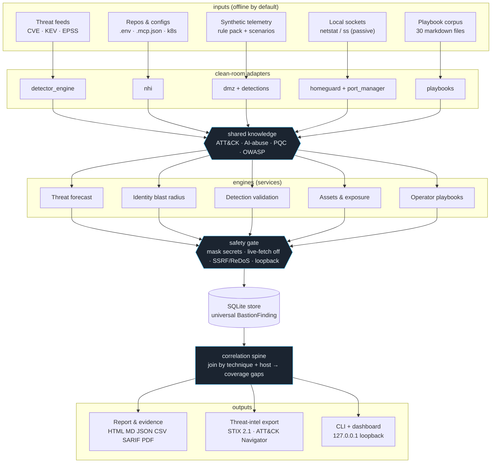

# Bastion explanations

Per-engine technical walkthroughs. Each page has a GitHub-rendered Mermaid
flowchart, a short "how to read it", and a "key code" map to the real functions.

- [System data flow](#system-data-flow) — the whole pipeline (this page)
- [Threat Forecast](01-threat-forecast.md)
- [Identity Blast Radius](02-identity-blast-radius.md)
- [Detection Validation](03-detection-validation.md)
- [Assets & Exposure](04-assets-exposure.md)
- [Correlation Spine](05-correlation-spine.md)
- [Safety Layer](06-safety-layer.md)

---

## System data flow

Inputs enter their own column, are processed by a clean-room adapter, enriched
by shared knowledge, masked at the safety gate, and stored as one universal
finding shape. The correlation spine then joins the stored records back together.

**How to read it.** The five columns are independent until they converge in the
store — that convergence onto one `BastionFinding` shape is what later lets the
correlation spine join across engines. The two diamond nodes and the correlation
box are *cross-cutting layers*, not pipeline stages: knowledge enriches every
adapter, and the safety gate is mandatory — nothing reaches the store or a report
unmasked.

**Key code.** Composition root: [`app.py`](../../src/greynoc_bastion/app.py)
(`BastionApp` wires adapters → services → db). Universal shape:
[`schemas/finding.py`](../../src/greynoc_bastion/schemas/finding.py). Safety:
[`safety/`](../../src/greynoc_bastion/safety/). Knowledge:
[`knowledge/`](../../src/greynoc_bastion/knowledge/).
